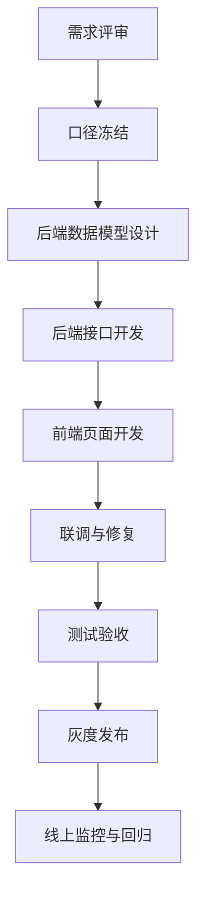
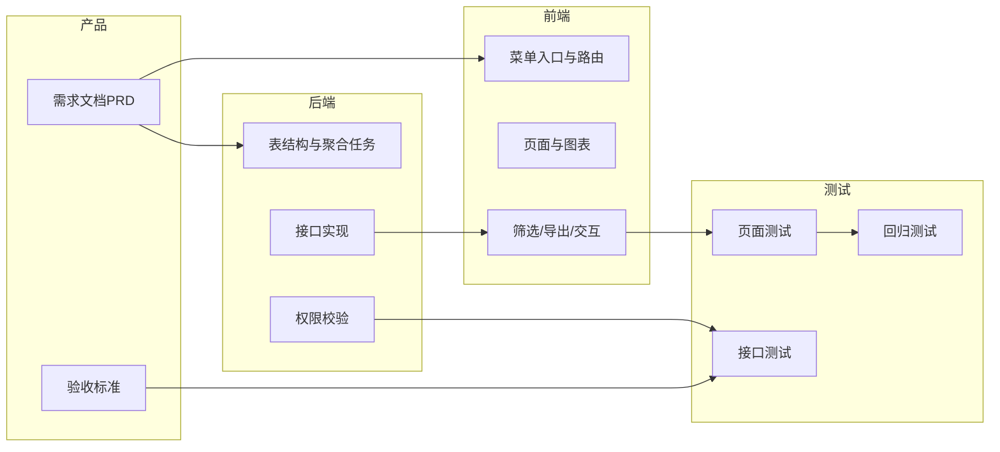

# 平台管理开发流程与技术工作文档

## 1. 开发总体流程图

## 2. 研发泳道图（协作方式）

## 3. 后端数据模型建议（MVP）
## 3.1 账单明细表 `billing_records`
| 字段 | 类型 | 说明 |
|---|---|---|
| id | bigint | 主键 |
| request_id | varchar(64) | 请求唯一标识 |
| space_id | bigint | 空间ID |
| project_type | varchar(16) | agent/app/workflow |
| project_id | bigint | 项目ID |
| model_id | varchar(64) | 模型标识 |
| usage_tokens | bigint | token消耗 |
| unit_price | decimal(16,8) | 单价 |
| amount | decimal(16,6) | 费用金额 |
| status | varchar(16) | success/failed/refund |
| occurred_at | bigint | 发生时间（ms） |
| created_at | bigint | 创建时间（ms） |

## 3.2 日聚合表 `billing_daily_agg`
| 字段 | 类型 | 说明 |
|---|---|---|
| dt | date | 统计日期 |
| space_id | bigint | 空间ID |
| project_type | varchar(16) | 项目类型 |
| total_tokens | bigint | 日token |
| total_amount | decimal(16,6) | 日费用 |
| success_count | bigint | 成功次数 |
| fail_count | bigint | 失败次数 |

## 3.3 预算配置表 `billing_budget_rules`
| 字段 | 类型 | 说明 |
|---|---|---|
| id | bigint | 主键 |
| space_id | bigint | 空间ID |
| monthly_budget | decimal(16,2) | 月预算 |
| alarm_thresholds | varchar(64) | 例如 `70,90,100` |
| over_limit_policy | varchar(16) | warn/reject |
| enabled | tinyint | 是否启用 |
| updated_by | bigint | 操作人 |
| updated_at | bigint | 更新时间（ms） |

## 4. 接口草案（REST）
## 4.1 计费总览
- `GET /api/platform/billing/overview`
- 参数：`start_time` `end_time` `space_ids` `project_type`
- 返回：指标卡 + 趋势数据 + Top排行

## 4.2 账单明细
- `GET /api/platform/billing/records`
- 参数：`page` `size` `keyword` `order_by` `order_direction`
- 返回：分页明细列表

## 4.3 账单导出
- `POST /api/platform/billing/records/export`
- 参数：筛选条件
- 返回：`task_id`（异步导出）

## 4.4 预算规则查询/保存
- `GET /api/platform/billing/budgets`
- `POST /api/platform/billing/budgets`

## 4.5 统计概览
- `GET /api/platform/stats/overview`
- 返回：活跃空间、调用量、成功率、时延、token

## 4.6 统计排行
- `GET /api/platform/stats/rankings`
- 参数：`metric`（calls/tokens/cost/fail_rate）

## 5. 前端开发任务拆解
1. 左侧菜单新增 `平台管理` 路由与权限控制。
2. 搭建一级页容器：Tab + 筛选栏 + 内容区。
3. 计费管理页实现：指标卡、趋势图、明细表、导出按钮。
4. 统计模块页实现：概览卡、趋势图、排行表。
5. 接口态处理：loading、空态、错误态、重试。
6. 统一风格：与空间管理模块视觉对齐。

## 6. 联调清单
1. 时间范围筛选口径一致（毫秒时间戳）。
2. 分页字段统一（`page` `size` `total`）。
3. 排序字段白名单校验。
4. 权限拦截统一返回码（无权限/登录失效）。
5. 导出任务状态轮询协议确认。

## 7. 测试用例清单（核心）
1. 平台管理员可见入口，非平台管理员不可见。
2. 每个筛选项单独变化时，数据刷新正确。
3. 账单排序升降序有效。
4. 导出任务成功并可下载文件。
5. 预算阈值生效并在超限时触发站内告警。
6. 空间维度隔离验证，禁止越权查看。

## 8. 里程碑计划（建议）
| 里程碑 | 周期 | 交付 |
|---|---|---|
| M1 需求冻结 | Day 1-2 | PRD + 原型 + 口径定义 |
| M2 后端可用 | Day 3-7 | 聚合接口 + 明细接口 + 预算接口 |
| M3 前端可用 | Day 6-10 | 页面与交互完成 |
| M4 联调测试 | Day 11-13 | 问题清单关闭 |
| M5 发布上线 | Day 14 | 灰度 + 监控 |

## 9. 上线观测与回滚
上线后监控：
- 接口成功率
- 页面首屏耗时
- 导出任务失败率
- 告警触发准确率

回滚策略：
1. 菜单入口支持配置开关，一键隐藏。
2. 新接口按路由级回滚，不影响空间管理主流程。
3. 导出任务异常时降级为“仅支持在线查看”。

