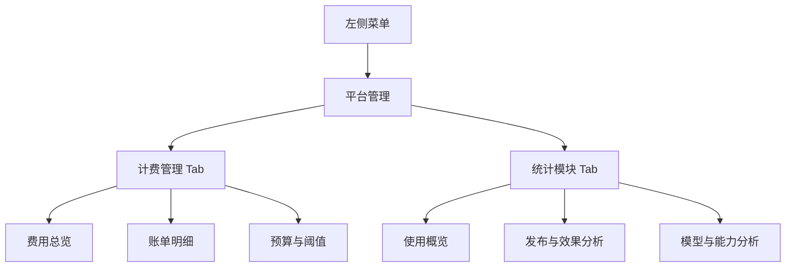
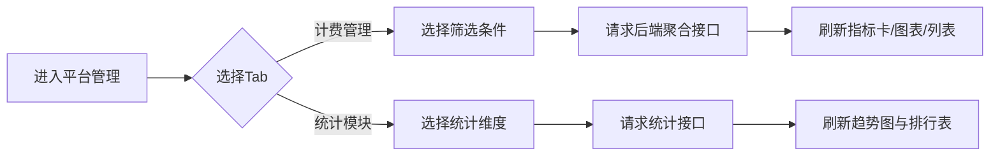

# 平台管理原型线框与交互稿（低保真）

## 1. 导航与页面结构图


## 2. 页面原型：平台管理首页
```text
+--------------------------------------------------------------------------------------+
| 平台管理                                                                              |
| [计费管理] [统计模块]                                                                 |
|--------------------------------------------------------------------------------------|
| 时间范围: [近7天 v]   空间: [全部空间 v]   项目类型: [全部 v]   [重置] [导出]         |
|--------------------------------------------------------------------------------------|
| [今日费用]     [本月累计费用]     [Token消耗]     [活跃空间数]                         |
|--------------------------------------------------------------------------------------|
| 费用趋势图(折线)                             | Top空间成本排行(柱状)                   |
|                                              |                                         |
|                                              |                                         |
+--------------------------------------------------------------------------------------+
```

## 3. 页面原型：计费管理 - 账单明细
```text
+--------------------------------------------------------------------------------------+
| 计费管理 / 账单明细                                                                   |
|--------------------------------------------------------------------------------------|
| 时间范围 [近30天 v] 空间 [全部 v] 项目类型 [全部 v] 关键字 [搜索框] [查询] [导出CSV]   |
|--------------------------------------------------------------------------------------|
| 时间↓↑ | 空间 | 项目类型 | 项目名称 | 模型/能力项 | 用量↓↑ | 单价 | 金额↓↑ | 状态      |
|--------------------------------------------------------------------------------------|
| 2026-03-01 09:20 | 空间A | 智能体 | 客服机器人 | Doubao-1.5-pro | 12,000 | 0.000X | X |
| 2026-03-01 09:15 | 空间B | 应用   | 应用B      | DeepSeek-R1    | 20,000 | 0.000X | X |
| ...                                                                                  |
|--------------------------------------------------------------------------------------|
| 分页: < 1 2 3 ... >                                                                   |
+--------------------------------------------------------------------------------------+
```

## 4. 页面原型：计费管理 - 预算与阈值
```text
+--------------------------------------------------------------------------------------+
| 计费管理 / 预算与阈值                                                                 |
|--------------------------------------------------------------------------------------|
| 空间 [全部空间 v]                                                                     |
|--------------------------------------------------------------------------------------|
| 空间名称 | 月预算(¥) | 告警阈值(%) | 超限策略                | 操作                  |
|--------------------------------------------------------------------------------------|
| 空间A    | [ 5000 ]  | [70,90,100] | (•)仅告警 ( )拒绝调用   | [保存]                |
| 空间B    | [10000 ]  | [70,90,100] | ( )仅告警 (•)拒绝调用   | [保存]                |
|--------------------------------------------------------------------------------------|
| 说明: 阈值触发后发送站内通知给平台管理员。                                             |
+--------------------------------------------------------------------------------------+
```

## 5. 页面原型：统计模块
```text
+--------------------------------------------------------------------------------------+
| 统计模块                                                                              |
|--------------------------------------------------------------------------------------|
| 时间范围 [近7天 v] 空间 [全部 v] 项目类型 [全部 v] [刷新]                              |
|--------------------------------------------------------------------------------------|
| [活跃空间DAU] [项目活跃数] [调用总量] [成功率] [平均时延] [总Token]                    |
|--------------------------------------------------------------------------------------|
| 调用趋势图(折线)                         | 成功率趋势(折线)                            |
|--------------------------------------------------------------------------------------|
| 项目排行表: 项目名 | 类型 | 调用量 | Token | 费用 | 失败率                              |
+--------------------------------------------------------------------------------------+
```

## 6. 关键交互流程图


## 7. UI 风格约束
1. Tab、筛选器、标签样式与现有空间管理模块保持一致。
2. 指标卡数字字号大于普通文本一级，颜色遵循主题色层级。
3. 表格行高与现有发布管理列表统一，避免视觉割裂。
4. 空状态、错误状态使用项目统一组件，不新增独立视觉体系。

